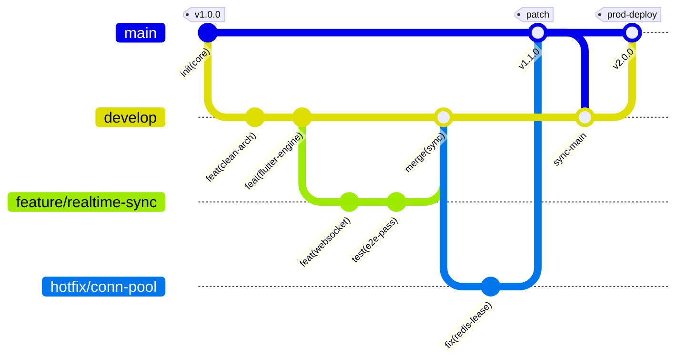
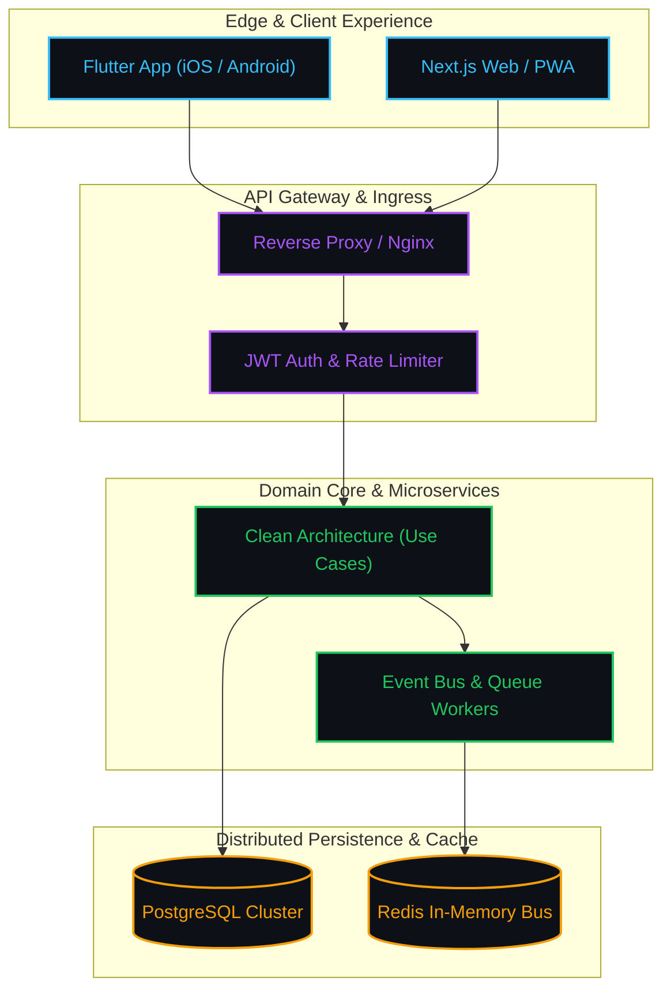

<div align="center">

<!-- ========================================================================= -->
<!-- DYNAMIC HERO BANNER & TERMINAL MOTD -->
<!-- ========================================================================= -->

```bash
╭─ naenmad@antipaya-station ‹main› in ~
╰─❯ banner --font slant "NAENMAD"
```

```text
   _  __ ___    ______ _   __ __  ___ ___    ____
  / |/ //   |  / ____// | / //  |/  //   |  / __ \
 /    // /| | / __/  /  |/ // /|_/ // /| | / /_/ /
/_/|_//_/ |_|/_____//_/|__//_/  /_//_/ |_|/_____/
```


<br/>

<!-- Dynamic Terminal Typing -->
<a href="https://github.com/naenmad">
  
</a>

<br/>

<!-- Quick Actions & Connect Hub -->
<p align="center">
  <a href="https://linkedin.com/in/naen" target="_blank">
    
  </a>
  <a href="https://youtube.com/@madnaen" target="_blank">
    
  </a>
  <a href="https://medium.com/@madnaen" target="_blank">
    
  </a>
  <!-- SPOTIFY BADGE (Commented out for easy rollback - uncomment below to restore)
  <a href="https://open.spotify.com/user/31mcp6bpg7ghj542srfj4n7jfw5a" target="_blank">
    
  </a>
  -->
  <a href="https://github.com/naenmad?tab=followers" target="_blank">
    
  </a>
  
</p>

<p align="center">
  <kbd>⌘</kbd> <kbd>K</kbd> <code>Nav-HUD</code> &nbsp;•&nbsp;
  <kbd>1</kbd> <a href="#telemetry">Telemetry</a> &nbsp;•&nbsp;
  <kbd>2</kbd> <a href="#profile">Architecture</a> &nbsp;•&nbsp;
  <kbd>3</kbd> <a href="#gitops">GitOps Flow</a> &nbsp;•&nbsp;
  <kbd>4</kbd> <a href="#refactoring">Clean Code</a> &nbsp;•&nbsp;
  <kbd>5</kbd> <a href="#stack">Tech Stack</a> &nbsp;•&nbsp;
  <kbd>6</kbd> <a href="#projects">Deployments</a> &nbsp;•&nbsp;
  <kbd>7</kbd> <a href="#game">Terminal Sim</a> &nbsp;•&nbsp;
  <kbd>:</kbd><kbd>w</kbd><kbd>q</kbd> <a href="#contact">Contact</a>
</p>

> [!IMPORTANT]
> **ENTERPRISE STATUS: OPEN FOR HIGH-IMPACT ARCHITECTURE & CONTRACTS**
> Currently designing modular, scalable digital experiences at **Antipaya Software House**. Specializing in Clean Architecture, High-Concurrency Microservices, and Fluid Cross-Platform Mobile Apps.

> [!TIP]
> **Interactive Profile**: Test production incident response protocols directly in this README! Jump to [<code>antipaya_quest.sh</code>](#game) to execute the on-call simulation.

</div>

---

<!-- ========================================================================= -->
<!-- SYSTEM OVERVIEW / FASTFETCH TERMINAL UI -->
<!-- ========================================================================= -->

<a id="telemetry"></a>
###  <code>system_info.sh</code> — Hardware & Kernel Telemetry

```bash
╭─ naenmad@antipaya-station ‹main*› in ~
╰─❯ fastfetch --profile engineer --format full
```

```yaml
# ╭────────────────────────────────────────────────────────────────────────────╮
# │ naenmad@antipaya-station: ~ (zsh)                                  ● ● ●   │
# ╰────────────────────────────────────────────────────────────────────────────╯

  ███╗   ██╗ █████╗ ███████╗███╗   ██╗   Identity  : Ahmad Zulkarnaen (@naenmad)
  ████╗  ██║██╔══██╗██╔════╝████╗  ██║   Role      : Full-Stack & Mobile Architect
  ██╔██╗ ██║███████║█████╗  ██╔██╗ ██║   Firm      : Antipaya Software House
  ██║╚██╗██║██╔══██║██╔══╝  ██║╚██╗██║   Location  : Bogor, Indonesia
  ██║ ╚████║██║  ██║███████╗██║ ╚████║   OS        : macOS Sonoma • Arch Linux x86_64
  ╚═╝  ╚═══╝╚═╝  ╚═╝╚══════╝╚═╝  ╚═══╝   Kernel    : Darwin 23.6.0 / Linux 6.10-zen
                                         Shell     : zsh 5.9 + Starship Prompt
                                         Terminal  : Ghostty / Alacritty (GPU-Accel)
                                         Editor    : Neovim 0.10 • VS Code (Tokyo Night)
                                         Stack     : Flutter • React / Next.js • Laravel • TypeScript
                                         DevOps    : Docker • CI/CD • PostgreSQL • Redis
                                         Uptime    : 99.99% • Continuous Deployment
                                         Status    : Available for high-impact architecture

# Palette : ■ ■ ■ ■ ■ ■ ■ ■
```

```text
  NORMAL   main  antipaya/system_info.sh  utf-8 [unix]  100%  42:1  [UP: 99.99%]
```

---

<!-- ========================================================================= -->
<!-- BENTO GRID: ABOUT & HIGHLIGHTS -->
<!-- ========================================================================= -->

<a id="profile"></a>
###  Engineering Profile & Architecture Focus

<table>
  <tr>
    <td width="55%" valign="top">
      <h4> Core Architecture & Workflow</h4>
      <ul>
        <li> <b>Modular & Scalable Design</b>: Crafting high-concurrency backend services and fluid mobile apps.</li>
        <li> <b>Clean Code Principles</b>: Applying SOLID, Clean Architecture, and Domain-Driven design.</li>
        <li> <b>Full-Stack Mastery</b>: Bridging dynamic frontend interfaces with rock-solid REST & Event-Driven APIs.</li>
        <li> <b>Enterprise Craftsmanship</b>: Driving software engineering excellence at <b>Antipaya Software House</b>.</li>
      </ul>
      <br/>
      <p>
        
        
        
      </p>
    </td>
    <td width="45%" valign="top">
      <h4> Live Telemetry</h4>

```typescript
// GET /api/v1/engineer/naenmad.ts
export const ArchitectProfile: Engineer = {
  identity: "Ahmad Zulkarnaen (@naenmad)",
  role: "Full-Stack & Mobile Architect",
  venture: "Antipaya Software House",
  corePillars: ["Clean Architecture", "Scalability", "High Performance"],
  philosophy: "Turn complex engineering into seamless UX",
  status: "Available for ambitious collaborations"
};
```

   </td>
  </tr>
</table>

---

<!-- ========================================================================= -->
<!-- GITOPS WORKFLOW & CONTINUOUS DELIVERY (NATIVE MERMAID) -->
<!-- ========================================================================= -->

<a id="gitops"></a>
###  GitOps Delivery Pipeline & Branching Model

<p align="center"><code>naenmad@antipaya:~$ git log --graph --oneline --decorate --all</code></p>



---

<!-- ========================================================================= -->
<!-- CODE REFACTORING STANDARDS: CLEAN ARCHITECTURE (DIFF) -->
<!-- ========================================================================= -->

<a id="refactoring"></a>
###  Engineering Standards: Legacy vs Antipaya Clean Architecture

<p align="center"><code>naenmad@antipaya:~$ git diff HEAD~1 src/core/usecases/CheckoutUseCase.ts</code></p>

```diff
- // [Anti-Pattern]: Monolithic coupling & raw database mutations in HTTP handler
- async function checkout(req, res) {
-   const user = await db.query("SELECT * FROM users WHERE id = ?", [req.body.uid]);
-   if (user.balance >= req.body.total) {
-     await db.query("UPDATE users SET balance = balance - ?", [req.body.total]);
-     await db.query("INSERT INTO orders (uid, total) VALUES (?, ?)", [user.id, req.body.total]);
-     sendInvoiceEmail(user.email);
-     return res.json({ status: "success" });
-   }
- }
+ // [Standard Pattern]: Domain-Driven Design, Atomic Unit-of-Work & Dependency Inversion
+ @Injectable()
+ export class CheckoutUseCase implements IUseCase<CheckoutCommand, Result<OrderReceipt>> {
+   constructor(
+     private readonly uow: IUnitOfWork,
+     private readonly paymentGateway: IPaymentGateway,
+     private readonly eventBus: IEventBus
+   ) {}
+ 
+   async execute(command: CheckoutCommand): Promise<Result<OrderReceipt>> {
+     return await this.uow.runInTransaction(async (session) => {
+       const account = await this.accountRepo.getByIdForUpdate(command.accountId, session);
+       const receipt = account.debit(command.amount, command.idempotencyKey);
+       
+       await this.paymentGateway.authorize(receipt);
+       await this.eventBus.publish(new OrderCompletedEvent(receipt));
+       return Result.ok(receipt);
+     });
+   }
+ }
```

---

<!-- ========================================================================= -->
<!-- MATHEMATICAL SLA & PERFORMANCE RIGOR (LATEX) -->
<!-- ========================================================================= -->

###  Algorithmic SLA & Concurrency Guarantees

$$
\begin{aligned}
\text{Throughput}(Q) &= \lim_{\Delta t \to 0} \frac{\int_0^{\Delta t} \lambda(t) \, dt}{\mathbb{E}[S_{\text{latency}}]} \quad \implies \quad \mathcal{O}(1) \text{ Lock-Free Concurrency Guarantee} \\
\text{System SLA } (\mathcal{A}) &= \frac{\text{MTBF}}{\text{MTBF} + \text{MTTR}} \ge 99.99\% \quad \left(\text{Permissible Downtime} \le 4.38 \text{ min/year}\right) \\
\text{Architecture Scalability} &= \lim_{\text{coupling} \to 0} \left( \sum \text{Cohesion} \times \text{Maintainability} \right) = \infty
\end{aligned}
$$

---

<!-- ========================================================================= -->
<!-- DISTRIBUTED ARCHITECTURE TOPOLOGY (NATIVE MERMAID) -->
<!-- ========================================================================= -->

###  Distributed Architecture Topology



---

<!-- ========================================================================= -->
<!-- ARSENAL & TECH STACK RADAR -->
<!-- ========================================================================= -->

<a id="stack"></a>
###  Technical Arsenal & Ecosystem

<p align="center"><code>naenmad@antipaya:~$ stack --list --tier production</code></p>

<div align="center">

<p align="center">
  <b>Languages & Core</b><br/>
  <a href="https://skillicons.dev">
    
  </a>
</p>

<p align="center">
  <b>Frontend & UI Architecture</b><br/>
  <a href="https://skillicons.dev">
    
  </a>
</p>

<p align="center">
  <b>Mobile Engineering</b><br/>
  <a href="https://skillicons.dev">
    
  </a>
</p>

<p align="center">
  <b>Backend, API & Cloud Services</b><br/>
  <a href="https://skillicons.dev">
    
  </a>
</p>

<p align="center">
  <b>DevOps, Tooling & Workflows</b><br/>
  <a href="https://skillicons.dev">
    
  </a>
</p>

</div>

---

<!-- ========================================================================= -->
<!-- GITHUB METRICS & REAL-TIME ANALYTICS -->
<!-- ========================================================================= -->

###  Performance & Repository Analytics

<p align="center"><code>naenmad@antipaya:~$ curl -s https://api.github.com/users/naenmad/telemetry</code></p>

<div align="center">

<table border="0">
  <tr>
    <td width="50%" align="center">
      
    </td>
    <td width="50%" align="center">
      
    </td>
  </tr>
  <tr>
    <td width="50%" align="center">
      
    </td>
    <td width="50%" align="center">
      
    </td>
  </tr>
</table>

</div>

---

<!-- ========================================================================= -->
<!-- CONTRIBUTION SNAKE ANIMATION -->
<!-- ========================================================================= -->

###  Activity Timeline & Commit Stream

<p align="center"><code>naenmad@antipaya:~$ git log --graph --snake-animation</code></p>

<div align="center">
  <picture>
    <source media="(prefers-color-scheme: dark)" srcset="https://raw.githubusercontent.com/naenmad/naenmad/output/snake.svg" />
    <source media="(prefers-color-scheme: light)" srcset="https://raw.githubusercontent.com/naenmad/naenmad/output/snake.svg" />
    
  </picture>
</div>

---

<!-- ========================================================================= -->
<!-- FEATURED WORKS & SOFTWARE HOUSE PORTFOLIO (INTERACTIVE CARDS) -->
<!-- ========================================================================= -->

<a id="projects"></a>
###  Featured Works & Production Deployments

<p align="center"><code>naenmad@antipaya:~$ docker ps --filter "status=running" --format "table {{.Names}}\t{{.Focus}}\t{{.Status}}"</code></p>

<div align="center">

| Initiative / Platform                     | Architecture Focus                            | Tech Stack                           |  Status   |
| :---------------------------------------- | :-------------------------------------------- | :----------------------------------- | :-------: |
| **Antipaya Core Architecture**         | Modular Enterprise Foundation & Microservices | `Laravel` `React` `TypeScript`       |  |
| **Cross-Platform Mobile Suite**        | Offline-First, High Performance Mobile UX     | `Flutter` `Dart` `Firebase`          |  |
| **Modern Web Ecosystem**               | High-Traffic Scalable SaaS Platforms          | `Next.js` `TailwindCSS` `PostgreSQL` |  |
| **DevOps & Infrastructure Automation** | CI/CD, Containerization & Server Workflows    | `Docker` `GitHub Actions` `Linux`    |  |

</div>

<br/>

<details>
  <summary><b>Explore Technical Capabilities at Antipaya Software House (Click to expand)</b></summary>
  <br/>

| Service                     | Scope & Deliverables                                                                  |
| :-------------------------- | :------------------------------------------------------------------------------------ |
| **Custom Development**   | Bespoke full-stack software tailored to demanding business logic                      |
| **Mobile Applications**  | Production-ready native (Android/Kotlin) & cross-platform (Flutter/React Native) apps |
| **Web Applications**     | Responsive, SEO-optimized, and resilient modern web systems                           |
| **Cloud Solutions**      | Microservices, RESTful & Event-Driven APIs, and database architecture                 |
| **Technical Consulting** | Tech-stack evaluation, code audit, and system design optimization                     |
| **Training & Workshops** | Hands-on engineering workshops and modern agile coaching                              |

</details>

---

<!-- ========================================================================= -->
<!-- DEVELOPER PHILOSOPHY & THOUGHT STREAM -->
<!-- ========================================================================= -->

###  Engineering Mindset & System Principles

<p align="center"><code>naenmad@antipaya:~$ fortune | cowsay -f dev</code></p>

<div align="center">
  
</div>

<!-- ========================================================================= -->
<!-- SPOTIFY PULSE (COMMENTED OUT FOR EASY ROLLBACK) -->
<!-- ========================================================================= -->
<!-- ROLLBACK INSTRUCTION: To re-enable Spotify, uncomment the block below:
<div align="center">
  <p><b>Listening Pulse</b></p>
  <a href="https://open.spotify.com/user/31mcp6bpg7ghj542srfj4n7jfw5a" target="_blank">
    
  </a>
</div>
-->

---

<!-- ========================================================================= -->
<!-- INTERACTIVE TERMINAL SIMULATION: THE ANTIPAYA QUEST -->
<!-- ========================================================================= -->

<a id="game"></a>
###  Interactive Terminal Simulation: <code>antipaya_quest.sh</code>

<p align="center"><code>guest@antipaya-station:~$ ./antipaya_quest.sh --interactive</code></p>

<div align="center">
  <p><b>[SRE TRIAGE SIMULATION] Execute interactive incident response protocols directly in this terminal session:</b></p>
</div>

<details>
<summary><b>[EXECUTE PROTOCOL] <code>guest@antipaya:~$ ./antipaya_quest.sh --init</code></b></summary>

<br/>

```yaml
# ╭────────────────────────────────────────────────────────────────────────────╮
# │ [INCIDENT REPORT] SEV-1 PRODUCTION OUTAGE - 03:14 AM              ● ● ●   │
# ╰────────────────────────────────────────────────────────────────────────────╯

  Status      : [ALERT: CRITICAL] Production Cluster Degradation
  Node        : prod-cluster-jakarta-01
  CPU Load    : 99.8% (Thread starvation detected)
  Incident    : Infinite recursion detected in payment dispatch loop
  On-Call     : Ahmad Zulkarnaen (@naenmad) - Status: Active
  Reserve     : [WARN: LOW] Energy reserve threshold breached

  Mission     : Triage the outage, restore cluster health, and execute hotfix protocol.
```

<p><b>Select triage strategy:</b></p>

---

<details>
<summary><b>[STRATEGY A] <code>tail -n 50 /var/log/antipaya/prod-api.log</code> (Inspect Server Logs)</b></summary>

<br/>

```bash
[03:14:02] [FATAL] [Worker-12] RangeError: Maximum call stack size exceeded
[03:14:03] [FATAL] [Worker-12] at TransactionRouter.dispatch (router.ts:88:21)
[03:14:04] [WARN]  [HealthCheck] Database connection pool exhausted: 500/500 active
[03:14:05] [ALERT] [PagerDuty] 4,200 transactions queued in the last 60 seconds!
```

> **Diagnosis**: A recursive handler was merged to `main` without an exit condition. Select remediation strategy:

<details>
<summary><b>[PATH A.1] Ad-hoc Hotfix: SSH into production container & modify runtime code</b></summary>

<br/>

```bash
guest@antipaya:~$ docker exec -it prod-api-01 nano src/router.ts
# Process interrupted. Critical signal dispatched: `kill -9 1`
```

```yaml
# [SYSTEM CRASH] UNCONTROLLED OUTAGE
  Result         : PID 1 terminated. Container exited (137). Gateway offline.
  Outcome        : Ahmad triggers automated immutable container rollback.
  Post-Mortem    : "Ad-hoc hotfixes directly on production containers violate SLA protocols."
  Classification : [BADGE: AD_HOC_COWBOY_CODER]
```
<p><i>[RESET REQUIRED] Collapse this option and evaluate alternative execution branches.</i></p>

</details>

<details>
<summary><b>[PATH A.2] Architecture Protocol: Isolate branch, implement regression test & deploy PR</b></summary>

<br/>

```bash
guest@antipaya:~$ git checkout -b hotfix/recursion-guard
guest@antipaya:~$ npm test -- --watchAll=false
```

```yaml
# [TEST SUITE TELEMETRY]
  PASS tests/unit/router.spec.ts (1.42s)
  PASS tests/integration/cluster.spec.ts (2.88s)
  ✓ handles recursive event loop without stack overflow (12ms)

  CI/CD          : GitHub Actions pipeline passed in 42s
  Status         : [STATUS: NOMINAL] 0% Error Rate, Latency 12ms
  Classification : [CERTIFICATION: PRINCIPAL_RELIABILITY_ENGINEER]
```
<p><b>Ahmad Zulkarnaen approves Pull Request: <i>"Clean Architecture ensures zero-downtime recovery."</i></b></p>

</details>

</details>

---

<details>
<summary><b>[STRATEGY B] <code>curl -X POST https://iot.antipaya.internal/espresso/brew</code> (Caffeine Ingestion Routine)</b></summary>

<br/>

```bash
guest@antipaya:~$ curl -X POST https://iot.antipaya.internal/espresso \
  -H "Authorization: Bearer AntipayaHQSecretKey" \
  -d '{"beans": "Aceh Gayo Single Origin", "shots": 3, "temp_c": 93}'
```

```yaml
# [IOT ESPRESSO TELEMETRY]
  Grinding    : Ceramic burr active (18.5g fine espresso grind)
  Extraction  : 28 seconds @ 9 bars of pressure
  Status      : [OPTIMAL] Triple Shot Espresso Dispensed

  System Buff : Cognitive Focus +300% • Static Analysis Speed +200%
```

> **Focus optimized**. Select debugging execution path:

<details>
<summary><b>[PATH B.1] High-Frequency Code Audit: Regex pattern scan via Neovim</b></summary>

<br/>

```bash
guest@antipaya:~$ nvim -R src/services/TransactionRouter.ts
# Line 42 identified:
# - while (hasPendingTransactions) { retryDispatch(); }
# + while (hasPendingTransactions && retries++ < MAX_RETRY_LIMIT) { retryDispatch(); }
```

```yaml
# [FAST-FORWARD DEPLOYMENT COMPLETE]
  Commit         : 7f3a9e1 "fix(router): add bounded retry guard against infinite dispatch"
  Review         : Fast-forward merged in 15 seconds
  Status         : [STATUS: NOMINAL] High-concurrency payment stream flowing smoothly
  Classification : [CERTIFICATION: ULTRA_CONCURRENCY_ARCHITECT]
```
<p><b>Ahmad presents commemorative token: <i>"Engineered with clean code and high reliability."</i></b></p>

</details>

<details>
<summary><b>[PATH B.2] Inspect Infrastructure Configuration: Read dotfiles audio stream</b></summary>

<br/>

```bash
guest@antipaya:~$ cat ~/.dotfiles/.secret_soundtrack
```

```yaml
# [DEVELOPER SOUNDWAVE VAULT]
  Track 01 : Synthwave Boy - "Subnet Midnight Drive"
  Track 02 : Lofi Girl - "Beats to Relax / Fix Docker Containers to"
  Track 03 : Hans Zimmer - "Time (When Deploying to Production)"

  Telemetry Note : "Spotify is commented out for easy rollback, but audio telemetry remains online."
  Classification : [BADGE: SOUNDWAVE_SYSTEMS_HACKER]
```

</details>

</details>

---

<details>
<summary><b>[STRATEGY C] <code>ai-agent --autopilot --solve-production</code> (Automated Heuristic Engine)</b></summary>

<br/>

```bash
guest@antipaya:~$ ai-agent --prompt "Please fix the cluster immediately, thank you"
```

```yaml
# [AI HEURISTIC TELEMETRY]
  Analysis       : Monorepo traversal completed (4,200 source files)
  Action         : Replaced payment service logic with a single 12,000-character regular expression
  Telemetry      : Cluster load reduced to 0.1%
  Status         : [STATUS: UNSTABLE] Heuristic patch applied, type verification pending
  Classification : [BADGE: CYBERPUNK_AUTOMATION_SORCERER]
```

<p><i>Ahmad Zulkarnaen: "Automation is powerful, but static analysis verification is required."</i></p>

</details>

<br/>

<div align="center">
  <p><i>[SIMULATION COMPLETE] Collapse and re-open any strategy above to evaluate alternative execution branches.</i></p>
</div>

</details>

---

<!-- ========================================================================= -->
<!-- COLLABORATION & FOOTER -->
<!-- ========================================================================= -->

<div align="center">

<a id="contact"></a>
<h3> Engineering Collaboration & Advisory</h3>

<p>
  Available for enterprise architecture consulting, technical leadership, and scalable software initiatives:
</p>

<p>
  <a href="https://linkedin.com/in/naen" target="_blank">
    
  </a>
  <a href="https://youtube.com/@madnaen" target="_blank">
    
  </a>
  <a href="https://medium.com/@madnaen" target="_blank">
    
  </a>
  <!-- SPOTIFY LINK (Commented out for easy rollback - uncomment below to restore)
  <a href="https://open.spotify.com/user/31mcp6bpg7ghj542srfj4n7jfw5a" target="_blank">
    
  </a>
  -->
</p>

<br/>


<p align="center">
  <code>naenmad@antipaya-station:~$ exit 0 # Session closed with status SUCCESS</code>
</p>

<p align="center">
  <i>Engineered with precision by <a href="https://github.com/naenmad"><b>naenmad</b></a></i>
</p>

</div>
